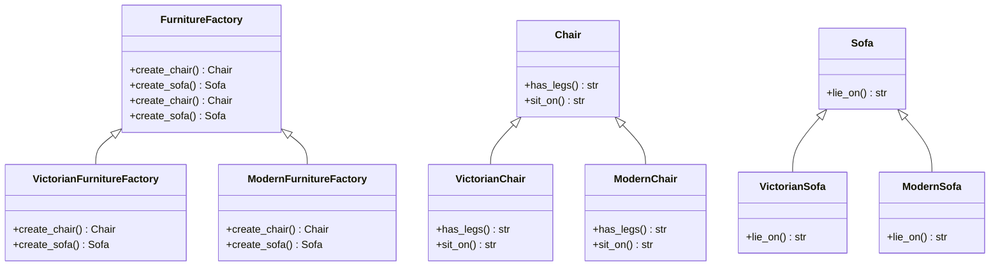

The **Abstract Factory Pattern** is another creational design pattern that provides an interface for creating families of related or dependent objects without specifying their concrete classes. This pattern is useful when a system needs to be independent of how its objects are created, composed, and represented, and when the system needs to be configured with one of multiple families of products.

**Key Components:**

- Abstract Factory: Declares a set of methods for creating each of the abstract products.
- Concrete Factory: Implements the methods defined by the abstract factory to create concrete products.
- Abstract Product: Declares an interface for a type of product.
- Concrete Product: Implements the abstract product interface.
- Client: Uses only the interfaces declared by the abstract factory and abstract product classes.

**Example in Python:**
Let's implement an abstract factory pattern for creating a set of related objects: chairs and sofas. We will have two styles of furniture: Victorian and Modern.

**Abstract Product Interfaces:**

```python
from abc import ABC, abstractmethod

class Chair(ABC):
    @abstractmethod
    def has_legs(self) -> str:
        pass

    @abstractmethod
    def sit_on(self) -> str:
        pass

class Sofa(ABC):
    @abstractmethod
    def lie_on(self) -> str:
        pass
```

**Concrete Products:**

```python
class VictorianChair(Chair):
    def has_legs(self) -> str:
        return "Victorian Chair has 4 legs."

    def sit_on(self) -> str:
        return "Sitting on a Victorian Chair."

class ModernChair(Chair):
    def has_legs(self) -> str:
        return "Modern Chair has no legs."

    def sit_on(self) -> str:
        return "Sitting on a Modern Chair."

class VictorianSofa(Sofa):
    def lie_on(self) -> str:
        return "Lying on a Victorian Sofa."

class ModernSofa(Sofa):
    def lie_on(self) -> str:
        return "Lying on a Modern Sofa."
```

**Abstract Factory Interface:**

```python

class FurnitureFactory(ABC):
    @abstractmethod
    def create_chair(self) -> Chair:
        pass

    @abstractmethod
    def create_sofa(self) -> Sofa:
        pass
```

**Concrete Factories:**

```python
class VictorianFurnitureFactory(FurnitureFactory):
    def create_chair(self) -> Chair:
        return VictorianChair()

    def create_sofa(self) -> Sofa:
        return VictorianSofa()

class ModernFurnitureFactory(FurnitureFactory):
    def create_chair(self) -> Chair:
        return ModernChair()

    def create_sofa(self) -> Sofa:
        return ModernSofa()
```

**Client Code:**

```python

def client_code(factory: FurnitureFactory):
    chair = factory.create_chair()
    sofa = factory.create_sofa()

    print(chair.has_legs())
    print(chair.sit_on())
    print(sofa.lie_on())

if __name__ == "__main__":
    print("Client: Testing client code with the Victorian factory:")
    client_code(VictorianFurnitureFactory())

    print("\nClient: Testing the same client code with the Modern factory:")
    client_code(ModernFurnitureFactory())
```

**Explanation:**
Chair and Sofa are abstract product interfaces with methods that must be implemented by concrete products.
VictorianChair, ModernChair, VictorianSofa, and ModernSofa are concrete products implementing the respective interfaces.
FurnitureFactory is the abstract factory interface with methods for creating chairs and sofas.
VictorianFurnitureFactory and ModernFurnitureFactory are concrete factories that return specific products.
When running the client code, it will use a specific factory to create a set of related products (chairs and sofas) and interact with them through their abstract interfaces.

**Benefits:**
Encapsulation of Concrete Classes: The client code works with abstract interfaces, not concrete classes, which means the specific implementations are hidden.
Easier to Exchange Families of Products: The client can use different families of products by switching the factory instance.
Consistency Among Products: Ensures that products created by a factory are compatible with each other.
**Conclusion:**
The Abstract Factory Pattern is useful when a system needs to be independent of the way its objects are created and composed. It provides an interface to create families of related objects, ensuring that the products created are consistent and compatible with each other. This pattern promotes flexibility and scalability in the design of a system.

**UML-Diagram:**


