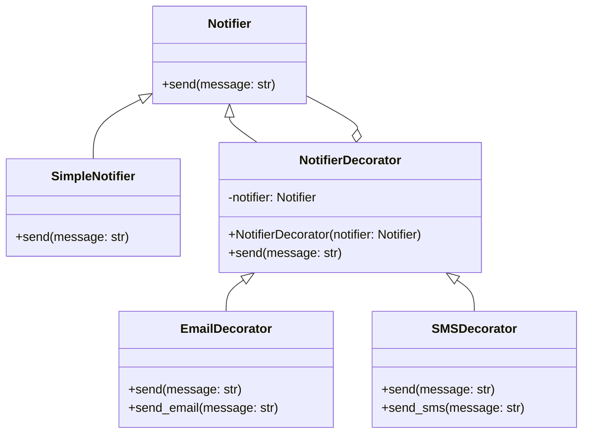

The **Decorator Pattern** is a structural design pattern that allows behavior to be added to individual objects, either statically or dynamically, without affecting the behavior of other objects from the same class. This pattern provides a flexible alternative to subclassing for extending functionality.

**Key Components:**

- Component: The interface or abstract class defining the methods that can be dynamically added to or overridden by decorators.
- Concrete Component: A class implementing the Component interface. This class is the primary object to which additional responsibilities can be attached.
- Decorator: An abstract class implementing the Component interface and containing a reference to a Component object. It delegates the component methods to the referenced Component object.
- Concrete Decorators: Classes that extend the Decorator class and override component methods to add extra behaviors.

**Example in Python:**
Let's implement the Decorator pattern to add additional functionalities to a basic notification system. We will start with a simple notification class and then add decorators for different notification methods (like email and SMS).

Component Interface:

```python
from abc import ABC, abstractmethod

class Notifier(ABC):
    @abstractmethod
    def send(self, message: str):
        pass
```

Concrete Component:

```python
class SimpleNotifier(Notifier):
    def send(self, message: str):
        print(f"Sending notification: {message}")
```

Decorator:

```python
class NotifierDecorator(Notifier):
    def __init__(self, notifier: Notifier):
        self._notifier = notifier

    def send(self, message: str):
        self._notifier.send(message)
```

Concrete Decorators:

```python
class EmailDecorator(NotifierDecorator):
    def send(self, message: str):
        super().send(message)
        self.send_email(message)

    def send_email(self, message: str):
        print(f"Sending email notification: {message}")

class SMSDecorator(NotifierDecorator):
    def send(self, message: str):
        super().send(message)
        self.send_sms(message)

    def send_sms(self, message: str):
        print(f"Sending SMS notification: {message}")
```

Client Code:

```python
if __name__ == "__main__":
    simple_notifier = SimpleNotifier()
    email_notifier = EmailDecorator(simple_notifier)
    sms_notifier = SMSDecorator(simple_notifier)
    combined_notifier = SMSDecorator(email_notifier)

    print("Simple Notifier:")
    simple_notifier.send("Hello!")

    print("\nEmail Notifier:")
    email_notifier.send("Hello!")

    print("\nSMS Notifier:")
    sms_notifier.send("Hello!")

    print("\nCombined Notifier (Email + SMS):")
    combined_notifier.send("Hello!")
```

**Explanation:**
Notifier is the component interface with the send method.
SimpleNotifier is the concrete component that implements the send method.
NotifierDecorator is the base decorator class that holds a reference to a notifier and delegates the send method to it.
EmailDecorator and SMSDecorator are concrete decorators that extend NotifierDecorator and add their specific functionalities.
When running the client code, you can see how different decorators add behaviors to the basic notifier without modifying its code. You can also combine multiple decorators to extend the functionality further.

**Benefits:**

- Single Responsibility Principle: The pattern allows functionalities to be divided among classes with unique areas of concern.
- Open/Closed Principle: Classes can be extended to incorporate new behavior without modifying the existing code.
- Flexible and Reusable Code: Decorators can be used in different combinations to add various functionalities dynamically.

**Conclusion:**
The Decorator Pattern is a powerful tool for dynamically adding behaviors to objects. It promotes flexible and reusable code by adhering to key object-oriented principles, making it easier to extend and maintain functionality in a clean and manageable way.

**UML Diagram:**


