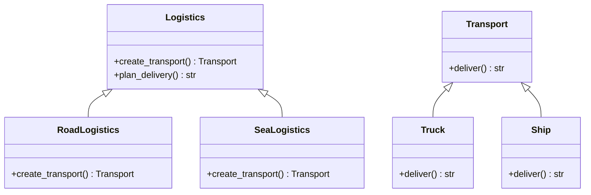

The **Factory Method Pattern** is a creational design pattern that provides an interface for creating objects in a superclass but allows subclasses to alter the type of objects that will be created. It helps in achieving loose coupling by reducing the dependency of code on concrete classes. This pattern is particularly useful when the exact type of the object to be created isn't known until runtime.

**Key Components:**

- Product: Defines the interface of objects the factory method creates.
- ConcreteProduct: Implements the Product interface.
- Creator: Declares the factory method which returns an object of type Product. This class may also define a default implementation of the factory method that returns a default ConcreteProduct object.
- ConcreteCreator: Overrides the factory method to return an instance of a ConcreteProduct.

**Example in Python:**
Let's implement a factory method pattern for a logistics company. This company can deliver goods either by truck or by ship.

First, we define the Product interface:

```python
from abc import ABC, abstractmethod

class Transport(ABC):
    @abstractmethod
    def deliver(self):
        pass
```

Next, we implement the concrete products:

```python
class Truck(Transport):
    def deliver(self):
        return "Delivering by land in a box."

class Ship(Transport):
    def deliver(self):
        return "Delivering by sea in a container."
```

Then, we define the Creator class:

```python
from abc import ABC, abstractmethod

class Logistics(ABC):
    @abstractmethod
    def create_transport(self) -> Transport:
        pass

    def plan_delivery(self):
        transport = self.create_transport()
        return transport.deliver()
```

Finally, we implement the concrete creators:

```python
class RoadLogistics(Logistics):
    def create_transport(self) -> Transport:
        return Truck()

class SeaLogistics(Logistics):
    def create_transport(self) -> Transport:
        return Ship()

```

Now, we can use the factory method pattern to create and deliver goods using different transport methods:

```python
def client_code(logistics: Logistics):
    print(logistics.plan_delivery())

if __name__ == "__main__":
    print("App: Launched with RoadLogistics.")
    client_code(RoadLogistics())

    print("\nApp: Launched with SeaLogistics.")
    client_code(SeaLogistics())

```

**Explanation:**

- Transport is the product interface with the deliver method.
- Truck and Ship are concrete products implementing the Transport interface.
- Logistics is the abstract creator class with the create_transport method, which must be overridden by subclasses.
- RoadLogistics and SeaLogistics are concrete creators that return specific products.
  When running the client code, it will use the specific logistics strategy to create the transport method and plan the delivery accordingly.

**Benefits:**
Single Responsibility Principle: The factory method allows the product creation code to be placed in one location, making the code easier to manage and modify.
Open/Closed Principle: New types of products can be added by introducing new subclasses, without modifying the existing code.

**Conclusion:**
The Factory Method Pattern is an effective way to manage and extend the creation of objects in a system. It provides flexibility in choosing the object to be created and encapsulates the instantiation logic, adhering to key principles of object-oriented design.

**UML-Diagram:**



All this might looking intimidating with all the code and UML diagrams. But the Factory Method Pattern is a simple and powerful pattern that can be used to create objects in a flexible and extensible way. Instead of using classes i.e. creater classes and concrete classes, we can also use functions to implement the Factory Method Pattern. Here is the same example using functions:

```python
class Transport:
    def deliver(self):
        pass

class Truck(Transport):
    def deliver(self):
        return "Delivering by land in a box."

class Ship(Transport):
    def deliver(self):
        return "Delivering by sea in a container."

def create_transport(transport_mode: str):
    transport_dict = {
        "road": Truck,
        "sea": Ship
    }
    return transport_dict.get(transport_mode)()

if __name__ == "__main__":
    print("App: Launched with RoadLogistics.")
    create_transport("road").deliver()

    print("\nApp: Launched with SeaLogistics.")
    create_transport("sea").deliver()
```

Strictly object-oriented design is not always necessary. The Factory Method Pattern can be implemented using functions, as shown in the example above.

Where is the Factory Method Pattern used in the Python standard library or popular Python packages?
**SQLAlchemy**
SQLAlchemy, a SQL toolkit and Object-Relational Mapping (ORM) library for Python, uses the Factory Method Pattern to create database connections and sessions.

Example: Creating a Database Session

```python
from sqlalchemy import create_engine
from sqlalchemy.orm import sessionmaker

# Create an engine using the factory method
engine = create_engine('sqlite:///example.db')

# Create a configured "Session" class using the factory method
Session = sessionmaker(bind=engine)

# Create a session using the factory method
session = Session()

```

For more details take a peek at [SqlAlchemy create_engine Factory Method](https://github.com/zzzeek/sqlalchemy/blob/main/lib/sqlalchemy/engine/create.py)
