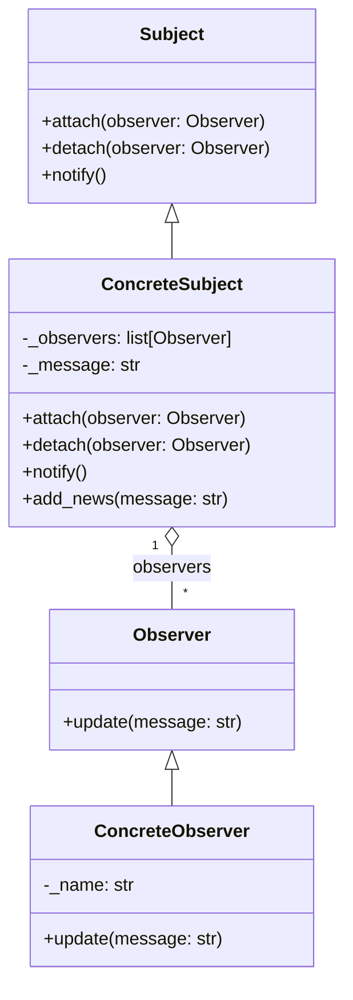

The **Observer Pattern** is a behavioral design pattern that defines a one-to-many dependency between objects so that when one object changes state, all its dependents are notified and updated automatically. This pattern is commonly used to implement distributed event-handling systems.

**Key Components:**

- Subject: The object that holds the state and sends notifications to observers when the state changes.
- Observer: The interface for objects that should be notified of changes in the subject.
- ConcreteSubject: A class that implements the Subject interface and stores the state of interest to ConcreteObservers.
- ConcreteObserver: A class that implements the Observer interface and keeps its state in sync with the subject's state.

**Example in Python:**
Let's implement an observer pattern for a simple newsletter subscription system. We'll have a newsletter (subject) and subscribers (observers).

_Observer Interface:_

```python

from abc import ABC, abstractmethod

class Observer(ABC):
    @abstractmethod
    def update(self, message: str):
        pass
```

_Subject Interface:_

```python
class Subject(ABC):
    @abstractmethod
    def attach(self, observer: Observer):
        pass

    @abstractmethod
    def detach(self, observer: Observer):
        pass

    @abstractmethod
    def notify(self):
        pass
```

_ConcreteSubject:_

```python
class Newsletter(Subject):
    def **init**(self):
        self._observers = []
        self._message = None

    def attach(self, observer: Observer):
        self._observers.append(observer)

    def detach(self, observer: Observer):
        self._observers.remove(observer)

    def notify(self):
        for observer in self._observers:
            observer.update(self._message)

    def add_news(self, message: str):
        self._message = message
        self.notify()
```

_ConcreteObserver:_

```python
class Subscriber(Observer):
    def __init__(self, name: str):
        self._name = name

    def update(self, message: str):
        print(f"{self._name} received message: {message}")
```

_Client Code:_

```python
if __name__ == "__main__":
    newsletter = Newsletter()

    subscriber1 = Subscriber("Alice")
    subscriber2 = Subscriber("Bob")

    newsletter.attach(subscriber1)
    newsletter.attach(subscriber2)

    newsletter.add_news("New edition of the newsletter is out!")

    newsletter.detach(subscriber1)

    newsletter.add_news("Second edition of the newsletter is out!")
```

**Explanation:**

- Observer: Defines the update method that will be called when the subject's state changes.
- Subject: Defines methods to attach, detach, and notify observers.
- Newsletter: Implements the Subject interface and maintains a list of observers. It notifies all observers when there is new news.
- Subscriber: Implements the Observer interface and prints the message it receives.
  When running the client code, you can see how subscribers receive updates when the newsletter publishes new editions, and how detaching a subscriber stops it from receiving further updates.

**Benefits:**

- Loose Coupling: Subjects and observers are loosely coupled, allowing for flexibility in the system design.
- Dynamic Relationships: Observers can be added or removed at runtime.
- Broadcast Communication: One update in the subject is automatically broadcast to all observers.

**Conclusion:**
The Observer Pattern is a powerful tool for implementing distributed event-handling systems. It promotes loose coupling and dynamic relationships, making it easier to add, remove, or change observers and subjects without affecting the overall system.

**UML Diagram:**



Here are some common places where the Observer Pattern is utilized in Python:

1. logging Module
   The logging module in Python uses a form of the Observer Pattern to notify multiple handlers about log events.

Example:

```python
import logging

# Create a logger
logger = logging.getLogger('my_logger')

# Create handlers
console_handler = logging.StreamHandler()
file_handler = logging.FileHandler('logfile.log')

# Set log levels
console_handler.setLevel(logging.DEBUG)
file_handler.setLevel(logging.INFO)

# Create a formatter and set it for the handlers
formatter = logging.Formatter('%(asctime)s - %(name)s - %(levelname)s - %(message)s')
console_handler.setFormatter(formatter)
file_handler.setFormatter(formatter)

# Add handlers to the logger
logger.addHandler(console_handler)
logger.addHandler(file_handler)

# Log messages
logger.debug('This is a debug message')
logger.info('This is an info message')
logger.warning('This is a warning message')
logger.error('This is an error message')
logger.critical('This is a critical message')
```
