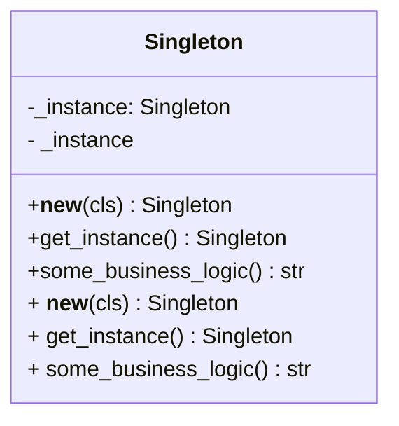

The **Singleton Pattern** is a creational design pattern that ensures a class has only one instance and provides a global point of access to that instance. This pattern is useful when exactly one object is needed to coordinate actions across a system.

Key Components:
Singleton Class: The class that is responsible for creating and maintaining its sole instance.
Implementation in Python:
In Python, the Singleton pattern can be implemented in various ways. Here are a few common approaches:

1. Using a Class Variable:
   This is a straightforward approach where a class variable holds the instance.

```python
class Singleton:
    _instance = None

    def __new__(cls, *args, **kwargs):
        if not cls._instance:
            cls._instance = super(Singleton, cls).__new__(cls, *args, **kwargs)
        return cls._instance

    def some_business_logic(self):
        # Example of some business logic method
        return "Executing business logic"

# Client code
singleton1 = Singleton()
singleton2 = Singleton()

print(singleton1 is singleton2)  # True
print(singleton1.some_business_logic())
```

2. Using a Decorator:
   This approach uses a decorator to convert a class into a singleton.

```python
def singleton(cls):
    instances = {}

    def get_instance(*args, **kwargs):
        if cls not in instances:
            instances[cls] = cls(*args, **kwargs)
        return instances[cls]

    return get_instance

@singleton
class Singleton:
    def some_business_logic(self):
        # Example of some business logic method
        return "Executing business logic"

# Client code
singleton1 = Singleton()
singleton2 = Singleton()

print(singleton1 is singleton2)  # True
print(singleton1.some_business_logic())
```

3. Using a Metaclass:
   A more advanced approach involves using a metaclass to control the instantiation of a class.

```python
class SingletonMeta(type):
    _instances = {}

    def __call__(cls, *args, **kwargs):
        if cls not in cls._instances:
            instance = super().__call__(*args, **kwargs)
            cls._instances[cls] = instance
        return cls._instances[cls]

class Singleton(metaclass=SingletonMeta):
    def some_business_logic(self):
        # Example of some business logic method
        return "Executing business logic"

# Client code

singleton1 = Singleton()
singleton2 = Singleton()

print(singleton1 is singleton2)  # True
print(singleton1.some_business_logic())
```

**Explanation:**

- _Class Variable Method:_ The **new** method ensures only one instance is created. The \_instance class variable holds the single instance.
- _Decorator Method:_ The decorator function singleton ensures that only one instance of the class exists by maintaining a dictionary of instances.
- _Metaclass Method:_ The SingletonMeta metaclass overrides the **call** method to control the instantiation process, ensuring only one instance of the class exists.

**Benefits:**

- Controlled Access to Sole Instance: Ensures a class has only one instance and provides a global point of access to it.
- Reduced Global State: Ensures that there is only one instance managing the global state, making it easier to manage and debug.
- Lazy Initialization: The instance is created only when it is needed for the first time.

**Conclusion:**
The Singleton Pattern is useful for managing shared resources or global state, such as configuration settings, logging instances, or database connections. By ensuring a class has only one instance, the pattern helps in maintaining consistency and controlling access across a system.

**UML-Diagram:**


